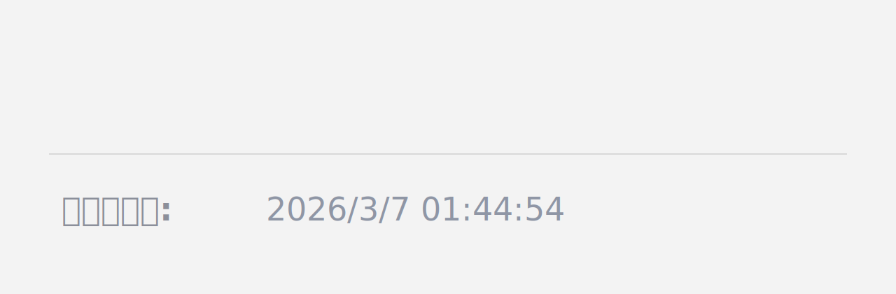

# Updated Footer

在 Typora 编辑区底部显示“最后更新于”时间，优先保证稳定，不修改正文和 front matter。

## 新增内容

- 新增独立插件 `Updated Footer`
- 页脚显示最后更新时间：`YYYY/M/D HH:mm:ss`
- 保存时立即刷新时间，再异步用文件真实修改时间（mtime）校准
- 切换文件后自动恢复显示，避免页脚丢失

## 演示图

## 安装方式

### 方式一：通过插件市场安装（在线安装）

当插件被社区插件市场收录后，可在 Typora 中：

- `Settings` -> `Plugin Marketplace`
- 搜索 `Updated Footer` 后安装

### 方式二：通过 Release 手动安装（本地安装）

1. 打开插件发布页并下载 `plugin.zip`：
   - https://github.com/RunwangGuo/typora-plugin-updated-footer/releases
2. 解压 `plugin.zip`，得到：
   - `main.js`
   - `manifest.json`
3. 在 Typora 插件目录创建文件夹：
   - `typora-community-plugin.updated-footer`
4. 把 `main.js` 和 `manifest.json` 放入该文件夹。
5. 重启 Typora，在“已安装插件”中启用 `Updated Footer`。

macOS 插件目录：

- `~/Library/Application Support/abnerworks.Typora/plugins/plugins/`

## 许可证

MIT，详见 [LICENSE](./LICENSE)。
