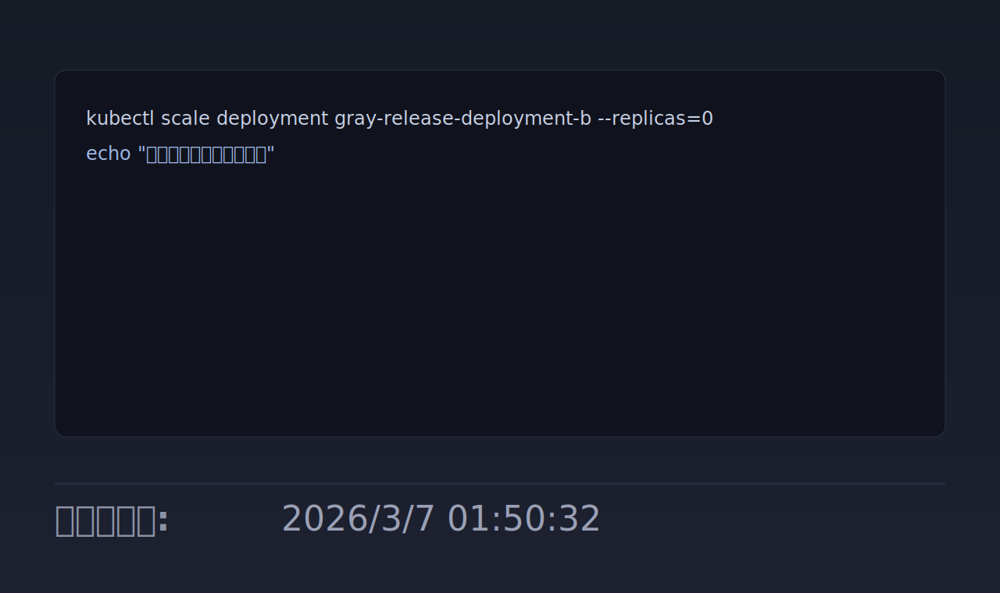

# Updated Footer

简体中文

在 Typora 编辑区底部显示“最后更新于”时间，专注稳定显示，不修改正文和 front matter。

## 新增内容

- 新增独立插件 `Updated Footer`
- 在页脚展示最后更新时间：`YYYY/M/D HH:mm:ss`
- 保存时立即刷新时间，再用文件真实 `mtime` 自动校准
- 定时兜底刷新，避免切换文件后页脚丢失

## 演示图

## 安装

将本目录 `typora-community-plugin.updated-footer` 放入 Typora 插件目录：

- macOS: `~/Library/Application Support/abnerworks.Typora/plugins/plugins/`

重启 Typora 后在“已安装插件”中启用 `Updated Footer`。
